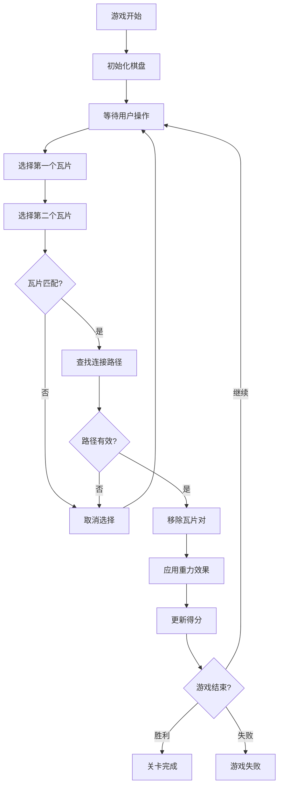

# Game.js 文件说明文档

## 概述

`app/game.js` 是 Link 拼图游戏的核心游戏页面组件，负责实现完整的游戏玩法逻辑、UI渲染和用户交互。

## 文件职责

### 主要功能
- 🎮 **游戏核心逻辑**：瓦片连接验证、路径查找算法
- 🎨 **游戏界面渲染**：棋盘显示、瓦片动画、UI控件
- ⏱️ **游戏状态管理**：时间倒计时、心数管理、得分计算
- 🔧 **道具系统**：提示、炸弹、洗牌功能实现
- 📱 **用户交互**：触摸事件处理、手势识别

### 技术特性
- 使用 React Native 构建跨平台游戏界面
- 集成 react-native-reanimated 实现流畅动画
- 与 Zustand store 深度集成进行状态管理
- 支持多种重力模式和布局变化

## 组件结构

```javascript
export default function Game() {
  // 状态管理
  const gameState = useGameStore(state => state.gameState);
  const { startLevel, completeLevel, useTool } = useGameStore();
  
  // 本地状态
  const [selectedTiles, setSelectedTiles] = useState([]);
  const [animatingTiles, setAnimatingTiles] = useState([]);
  const [showPath, setShowPath] = useState(null);
  
  // 游戏逻辑
  const handleTilePress = (row, col) => { /* 瓦片点击处理 */ };
  const findPath = (start, end) => { /* 路径查找算法 */ };
  const validateConnection = (tile1, tile2) => { /* 连接验证 */ };
  
  // UI渲染
  return (
    <SafeAreaView style={styles.container}>
      {/* 游戏界面组件 */}
    </SafeAreaView>
  );
}
```

## 核心算法

### 1. 路径查找算法
```javascript
/**
 * 查找两个瓦片之间的连接路径
 * 规则：路径转弯次数 ≤ 2次
 * @param {Object} start - 起始瓦片坐标 {row, col}
 * @param {Object} end - 目标瓦片坐标 {row, col}
 * @returns {Array|null} - 路径坐标数组或null
 */
const findPath = (start, end) => {
  // 直线连接（0转弯）
  if (canConnectDirectly(start, end)) {
    return generateDirectPath(start, end);
  }
  
  // 一次转弯连接
  const oneCornerPath = findOneCornerPath(start, end);
  if (oneCornerPath) return oneCornerPath;
  
  // 两次转弯连接
  const twoCornerPath = findTwoCornerPath(start, end);
  return twoCornerPath;
};
```

### 2. 重力系统实现
```javascript
/**
 * 根据重力模式移动瓦片
 * @param {string} gravityMode - 重力模式：Static/Left/Right/Up/Down/Split
 * @param {Array} board - 当前棋盘状态
 * @param {Array} removedPositions - 被移除的瓦片位置
 */
const applyGravity = (gravityMode, board, removedPositions) => {
  switch (gravityMode) {
    case 'Left': return moveLeft(board, removedPositions);
    case 'Right': return moveRight(board, removedPositions);
    case 'Up': return moveUp(board, removedPositions);
    case 'Down': return moveDown(board, removedPositions);
    case 'Split': return moveSplit(board, removedPositions);
    default: return board; // Static模式
  }
};
```

## 游戏状态流程

### 游戏生命周期


### 状态更新流程
1. **瓦片选择** → 更新 `selectedTiles` 状态
2. **路径验证** → 显示连接路径动画
3. **瓦片移除** → 触发消除动画
4. **重力应用** → 瓦片位置重新计算
5. **得分更新** → 同步到全局状态

## UI组件层次

```
Game (主容器)
├── GameHeader (游戏顶部信息)
│   ├── TimeDisplay (时间显示)
│   ├── HeartDisplay (心数显示)
│   ├── ScoreDisplay (得分显示)
│   └── PauseButton (暂停按钮)
├── GameBoard (游戏棋盘)
│   ├── TileGrid (瓦片网格)
│   │   └── Tile[] (瓦片组件数组)
│   ├── PathOverlay (路径显示层)
│   └── AnimationLayer (动画层)
├── GameTools (道具栏)
│   ├── HintButton (提示按钮)
│   ├── BombButton (炸弹按钮)
│   └── ShuffleButton (洗牌按钮)
└── GameFooter (游戏底部)
    ├── HomeButton (主页按钮)
    └── RestartButton (重新开始按钮)
```

## 动画系统

### 瓦片动画类型
- **选择动画**：瓦片被选中时的高亮效果
- **连接动画**：显示连接路径的线条动画
- **消除动画**：瓦片消失的缩放/淡出效果
- **重力动画**：瓦片移动到新位置的平移动画
- **道具动画**：使用道具时的特效动画

### 动画实现
```javascript
// 使用 react-native-reanimated
const tileScale = useSharedValue(1);
const tileOpacity = useSharedValue(1);

const animatedStyle = useAnimatedStyle(() => ({
  transform: [{ scale: tileScale.value }],
  opacity: tileOpacity.value,
}));

// 瓦片消除动画
const removeTileAnimation = () => {
  tileScale.value = withTiming(0, { duration: 300 });
  tileOpacity.value = withTiming(0, { duration: 300 });
};
```

## 道具系统实现

### 道具功能
```javascript
const toolHandlers = {
  hint: () => {
    // 查找可连接的瓦片对
    const hintPair = findConnectablePair(board);
    if (hintPair) {
      highlightTiles(hintPair);
      useTool('hint');
    }
  },
  
  bomb: () => {
    // 随机移除一对可连接瓦片
    const randomPair = findRandomConnectablePair(board);
    if (randomPair) {
      removeTilesWithAnimation(randomPair);
      useTool('bomb');
    }
  },
  
  shuffle: () => {
    // 重新排列剩余瓦片
    const newBoard = shuffleBoard(board);
    setBoardWithAnimation(newBoard);
    useTool('shuffle');
  }
};
```

## 性能优化

### 优化策略
1. **虚拟化渲染**：大棋盘使用 FlatList 虚拟化
2. **动画优化**：使用 `runOnUI` 在UI线程执行动画
3. **状态缓存**：缓存路径查找结果避免重复计算
4. **内存管理**：及时清理动画引用和定时器

### 代码示例
```javascript
// 使用 useMemo 缓存计算结果
const connectablePairs = useMemo(() => {
  return findAllConnectablePairs(board);
}, [board]);

// 使用 useCallback 避免重复创建函数
const handleTilePress = useCallback((row, col) => {
  // 处理瓦片点击
}, [selectedTiles, board]);
```

## 错误处理

### 异常情况处理
- **无效路径**：提示用户选择其他瓦片
- **无可连接对**：自动触发洗牌或提示使用道具
- **时间耗尽**：显示游戏失败界面
- **心数耗尽**：显示重新开始选项

## 测试要点

### 功能测试
- [ ] 瓦片连接逻辑正确性
- [ ] 路径查找算法准确性
- [ ] 重力系统各模式表现
- [ ] 道具功能正常工作
- [ ] 动画流畅度和性能

### 边界测试
- [ ] 空棋盘处理
- [ ] 单个瓦片剩余
- [ ] 极限时间压力
- [ ] 道具库存为0的情况

## 扩展功能

### 未来可添加功能
- **多人对战模式**
- **自定义瓦片主题**
- **关卡编辑器**
- **回放系统**
- **成就系统**

## 依赖关系

### 外部依赖
- `react-native-reanimated`: 动画系统
- `react-native-gesture-handler`: 手势处理
- `@expo/vector-icons`: 图标组件

### 内部依赖
- `../store/gameStore`: 游戏状态管理
- `../components/SparkAnimation`: 火花动画组件
- `../components/BambooAnimation`: 竹子动画组件

## 维护说明

### 代码规范
- 使用 TypeScript 类型注解
- 遵循 React Hooks 最佳实践
- 保持组件单一职责原则
- 添加详细的注释说明

### 调试技巧
- 使用 `console.log` 跟踪游戏状态
- 利用 React DevTools 检查组件状态
- 使用 Flipper 调试动画性能
- 添加开发模式下的调试面板